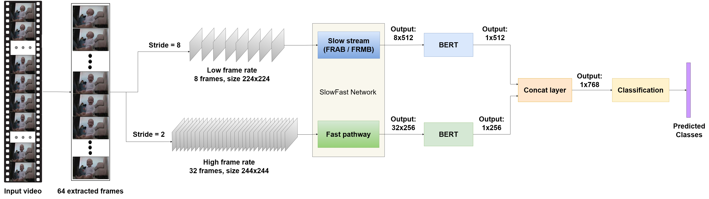

# Action-Identification-with-Fusion-of-BERT-and-3DCNN-for-Smart-Home-Systems

## Key features
- A fusion of SlowFast and Bidirectional Encoder Representation from Transformer (BERT) for action identification.
- Efficently exposing temporal relationship between video frames using BERT's Attention Mechanism.
- Two modalities in fusing SlowFast and BERT for action identification: late-ensemble and early-ensemble.
- Kinetics51 dataset: a derived dataset from Kinetics400.

#### Late-ensemble SlowFast-BERT

#### Early-ensemble SlowFast-BERT

## Datasets:
  - **HMDB51**:
    - Website to the dataset: https://serre-lab.clps.brown.edu/resource/hmdb-a-large-human-motion-database/
    - For more information about the train, validate and test samples, please visit <a href="datasets/HMDB51"><strong>datasets/HMDB51</strong></a> folder.
  - **Kinetics51** (a part of Kinetics400): 
    - Website to the original dataset: https://www.deepmind.com/open-source/kinetics
    - For more information about the train, validate and test samples, please visit <a href="datasets/Kinetics51"><strong>datasets/Kinetics51</strong></a> folder.

## Benchmark

### Experiments on HMDB51 dataset
| Model | Dimensionality reduction | Combine BERT | Pretrained dataset | Top-1 accuracy | Top-3 accuracy |
| :---: | :---: | :---: | :---: | :---: | :---: |
| SlowFast | No | No | Kinetics400 | 77.53% | 90.87% |
| SlowFast FRAB BERT early | FRAB | Early-ensemble | Kinetics400 | 76.62% | 91.03% |
| SlowFast FRAB BERT late | FRAB | Late-ensemble | Kinetics400 | 78.05% | 91.63% |
| SlowFast FRMB BERT early | FRMB | Early-ensemble | No | 76.40% | 91.40% |
| SlowFast FRMB BERT late | FRMB | Late-ensemble | No | 78.73% | 91.40% |

### Comparison with state-of-the-art on HMDB51 dataset
| Model | Pretrained dataset | Year | Top-1 accuracy |
| :---: | :---: | :---: | :---: |
| Shuffle and Learn (AlexNet) | UCF101 | Mar 2016 | 19.8% |
| OPN (VGG-M-2048) | UCF101 | Oct 2017 | 23.8% |
| 3D Cubic Puzzles (3D ResNet-18) | Kinetics400 | Nov 2018 | 33.7% |
| DPC (Modified 3D Resnet-34) | Kinetics400 | Sep 2019 | 35.7% |
| XDC | IG-Kinetics | Dec 2020 | 68.9% |
| CVRL (R3D-152 2x; K600) | Kinetics600 | Jun 2021 | 69.9% |
| BraVe:V-FA (TSM-50x2) |  | Oct 2021 | 70.5% |
| pBYOL | Kinetics400 | Nov 2021 | 75.0% |
| **SlowFast FRAB BERT late (Ours)** | Kinetics400 | Dec 2022 | 78.05% |

### Experiments on Kinetics51 dataset
| Model | Dimensionality reduction | Combine BERT | Pretrained dataset | Top-1 accuracy | Top-3 accuracy |
| :---: | :---: | :---: | :---: | :---: | :---: |
| SlowFast | No | No | Kinetics400 | 79.08% | 93.14% |
| SlowFast FRAB BERT late | FRAB | Late-ensemble | Kinetics400 | 82.52% | 95.02% |
| SlowFast FRAB BERT early | FRAB | Early-ensemble | Kinetics400 | 82.43% | 94.61% |
