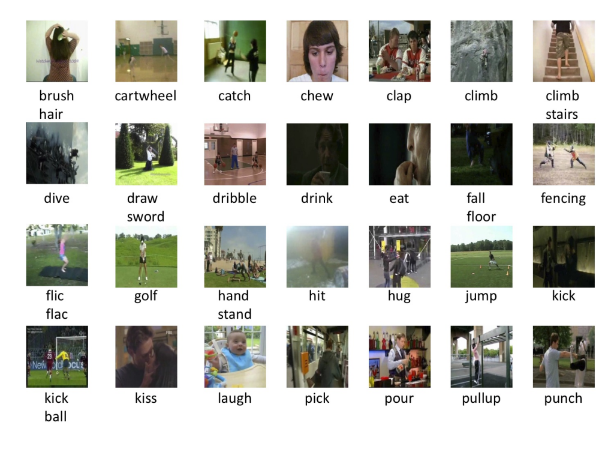

# HMD51: a large human motion database

- Website to the dataset: https://serre-lab.clps.brown.edu/resource/hmdb-a-large-human-motion-database/
## Structure
- classes.txt: contains 51 human action classes for HMDB51 dataset
- train.txt: contains samples for traning
- val.txt: contains samples for validating
- test.txt: contains samples for testing
### File structure for train.txt, val.txt and val.txt
- All of 3 files have 3 columns:
  - First column: name of the video
  - Second column: number of frames of corresponding video
  - Third column: the label of the video (mapping with the index of class name in classes.txt)

- Example:
*BIG_FISH_walk_f_nm_np1_ba_med_12 73 49*

  - **Video name**: BIG_FISH_walk_f_nm_np1_ba_med_12

  - **Number of frames**: 73 frames

  - **Label**: 49 (walk - index starting from 0)
