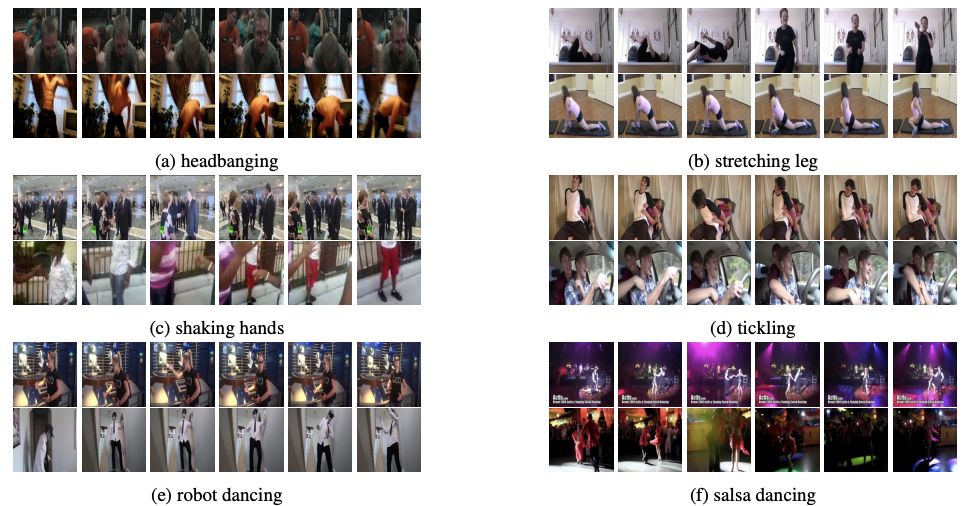

# Kinetics51: a derived dataset from Kinetics400

- Website to the original dataset: https://www.deepmind.com/open-source/kinetics
## Structure
- classes.txt: contains 51 human action classes for Kinetics51 dataset.
- train.txt: contains samples for training.
- val.txt: contains samples for validating.
- test.txt: contains samples for testing.
### File structure for train.txt, val.txt and val.txt
- All of 3 files have 3 columns:
  - First column: name of the video.
  - Second column: number of frames of corresponding video.
  - Third column: the label of the video (mapping with the index of class name in classes.txt).

- Example:
*4jmv1XpnR90 300 30*

  - **Video name**: 4jmv1XpnR90

  - **Number of frames**: 300 frames

  - **Label**: 30 (riding or walking with horse - index starting from 0)

#### How to get videos for this work
- The Kinetics51 dataset is collected from YouTube, and the video name is also the ID of the YouTube link to the corresponding video.
- Example:
  - With video name *4jmv1XpnR90* above, the link to the video would be https://www.youtube.com/watch?v=4jmv1XpnR90. Similiar for other videos, concatenate the prefix **https://youtube.com/watch?v=** with **video name** to get the video link.
  - Video can be downloaded using open-source software (such as <a href="https://github.com/ytdl-org/youtube-dl"><strong>youtube-dl</strong></a>).
